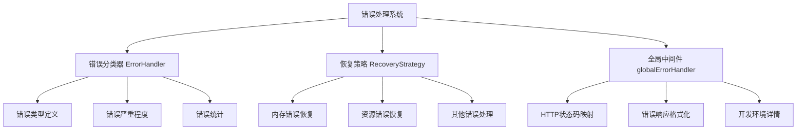

# 错误处理模块分析报告

## 概述

本报告对 `src/middleware` 和 `src/errors` 目录的错误处理模块进行了全面分析，评估其覆盖范围、实现逻辑和潜在问题。

## 模块结构分析

### 1. 核心组件



### 2. 错误类型覆盖分析

| 错误类型 | 严重程度 | 是否可恢复 | 实现状态 |
|---------|---------|-----------|----------|
| VALIDATION_ERROR | LOW | ❌ | ✅ 完整 |
| UNSUPPORTED_LANGUAGE | MEDIUM | ❌ | ✅ 完整 |
| PARSE_ERROR | MEDIUM | ❌ | ✅ 完整 |
| QUERY_ERROR | MEDIUM | ❌ | ✅ 完整 |
| MEMORY_ERROR | HIGH | ✅ | ✅ 完整 |
| TIMEOUT_ERROR | MEDIUM | ❌ | ✅ 完整 |
| INTERNAL_ERROR | HIGH | ✅ | ✅ 完整 |
| RESOURCE_ERROR | HIGH | ✅ | ✅ 完整 |

## 实现逻辑问题分析

### 1. 依赖循环问题

**问题发现**: [`src/middleware/globalErrorHandler.ts`](src/middleware/globalErrorHandler.ts:10-13) 依赖 [`@/errors/ErrorHandler`](src/errors/ErrorHandler.ts) 和 [`@/errors/RecoveryStrategy`](src/errors/RecoveryStrategy.ts)，但后者又依赖 [`@/core/ResourceCleaner`](src/errors/RecoveryStrategy.ts:2-3) 和 [`@/core/MemoryMonitor`](src/errors/RecoveryStrategy.ts:3)，这些核心模块可能尚未实现。

**影响**: 运行时会出现模块未找到错误。

### 2. 错误分类逻辑问题

**问题发现**: [`src/errors/ErrorHandler.ts`](src/errors/ErrorHandler.ts:35-114) 中的 `classifyError` 方法仅基于错误消息字符串匹配进行分类，这种方式：

1. **可靠性差**: 依赖错误消息文本，容易误判
2. **扩展性差**: 新增错误类型需要修改硬编码逻辑
3. **维护困难**: 字符串匹配逻辑复杂且容易出错

### 3. 恢复策略实现问题

**问题发现**: [`src/errors/RecoveryStrategy.ts`](src/errors/RecoveryStrategy.ts:46-76) 中的恢复方法假设依赖模块已实现：

- `resourceCleaner.performCleanup()` 方法不存在
- `memoryMonitor.checkMemory()` 方法不存在
- `resourceCleaner.forceGarbageCollection()` 方法不存在

### 4. 错误统计实现问题

**问题发现**: [`src/errors/ErrorHandler.ts`](src/errors/ErrorHandler.ts:164-181) 中的 `getErrorStats()` 方法：

1. **硬编码时间窗口**: 使用固定的5分钟窗口
2. **缺乏配置化**: 无法通过配置调整统计参数
3. **内存泄漏风险**: 长期运行会积累大量历史记录

### 5. 类型定义完整性问题

**问题发现**: [`src/types/errors.ts`](src/types/errors.ts:90-112) 中定义了 `MemoryStatus`、`CleanupResult`、`HealthStatus` 等接口，但这些类型在错误处理模块中并未使用，存在定义冗余。

## 覆盖场景评估

### ✅ 已覆盖的基本场景

1. **HTTP错误处理**: 完整的Express中间件架构
2. **错误分类**: 支持8种主要错误类型
3. **错误严重程度**: 4级严重程度划分
4. **错误统计**: 基础统计功能
5. **恢复策略**: 理论上的恢复框架

### ❌ 缺失的重要场景

1. **异步错误边界**: 缺乏对Promise链错误的完整处理
2. **错误重试机制**: 没有实现自动重试逻辑
3. **分布式追踪**: 缺乏请求ID的完整追踪链
4. **监控集成**: 没有与监控系统（如Prometheus）集成
5. **告警机制**: 缺乏错误率告警功能

## 架构设计评估

### 优点

1. **模块化设计**: 错误处理、恢复策略、中间件分离良好
2. **类型安全**: 完整的TypeScript类型定义
3. **可扩展性**: 易于添加新的错误类型和恢复策略
4. **文档完整**: 详细的README和使用示例

### 缺点

1. **实现不完整**: 多个依赖模块缺失
2. **测试覆盖不足**: 缺乏单元测试和集成测试
3. **配置缺失**: 缺乏运行时配置机制
4. **性能考虑不足**: 没有考虑高频错误处理的性能影响

## 改进建议

### 短期改进（高优先级）

1. **修复依赖问题**:
   ```typescript
   // 创建模拟实现或简化依赖
   class SimpleResourceCleaner {
     async performCleanup() { return { success: true }; }
     async forceGarbageCollection() { return true; }
   }
   ```

2. **改进错误分类**:
   ```typescript
   // 使用错误码而非字符串匹配
   interface ErrorCodeMap {
     [code: string]: ErrorType;
   }
   ```

3. **添加配置支持**:
   ```typescript
   interface ErrorHandlerConfig {
     maxErrorHistory: number;
     recentErrorWindow: number;
     errorRateThreshold: number;
   }
   ```

### 中期改进（中优先级）

1. **实现完整的核心模块**:
   - ResourceCleaner
   - MemoryMonitor  
   - ParserPool

2. **添加测试覆盖**:
   - 单元测试 for ErrorHandler
   - 集成测试 for globalErrorHandler
   - 性能测试 for 高错误率场景

3. **增强监控集成**:
   - Prometheus metrics
   - Health check endpoints
   - Error rate dashboards

### 长期改进（低优先级）

1. **分布式追踪集成**
2. **自动重试机制**
3. **智能恢复策略**
4. **机器学习异常检测**

## 结论

当前错误处理模块**架构设计良好但实现不完整**。核心问题是：

1. **循环依赖**: 错误处理模块依赖未实现的核心模块
2. **分类逻辑脆弱**: 基于字符串匹配的错误分类不可靠
3. **恢复策略不完整**: 依赖缺失的清理和监控功能

**建议优先解决依赖问题**，通过模拟实现或简化架构来使错误处理模块可运行，然后逐步完善功能。

---
**分析时间**: 2025-11-18  
**分析版本**: 当前代码库状态  
**分析师**: 架构模式分析