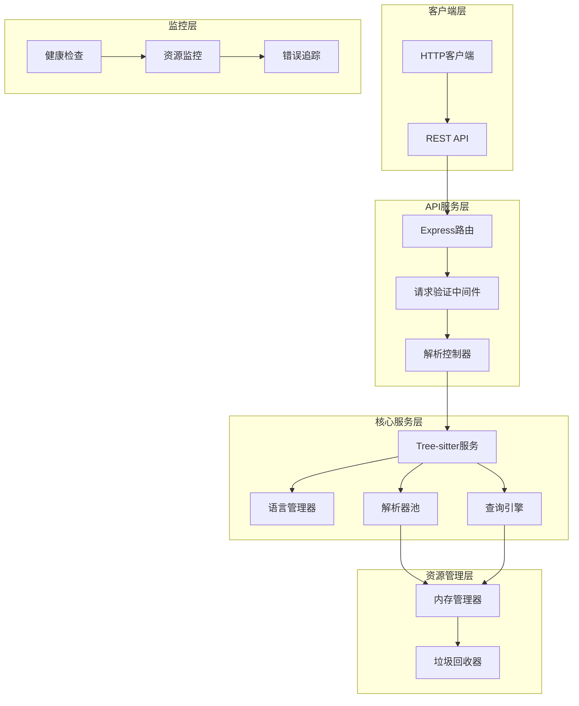

# 基于原生Tree-sitter的轻量级API架构设计

## 设计目标

1. **完全弃用WASM**：使用原生Tree-sitter Node.js绑定替代web-tree-sitter
2. **资源节约**：针对小规模使用场景，优化内存和CPU使用
3. **简化部署**：减少依赖，简化配置和部署流程
4. **稳定性优先**：确保在资源受限环境下的稳定运行

## 架构概览



## 核心组件设计

### 1. 语言管理器 (LanguageManager)

负责管理和加载各种编程语言的Tree-sitter解析器：

```typescript
// src/core/LanguageManager.ts
export class LanguageManager {
    private languageModules: Map<string, any> = new Map();
    private supportedLanguages: Set<string> = new Set();

    constructor() {
        this.initializeLanguages();
    }

    private initializeLanguages() {
        // 按需加载语言模块，避免启动时加载所有语言
        const languages = [
            'javascript', 'typescript', 'python', 'java', 'go', 
            'rust', 'cpp', 'c', 'csharp', 'ruby'
        ];
        
        languages.forEach(lang => this.supportedLanguages.add(lang));
    }

    async getLanguage(language: string): Promise<any> {
        if (!this.supportedLanguages.has(language)) {
            throw new Error(`Unsupported language: ${language}`);
        }

        // 懒加载语言模块
        if (!this.languageModules.has(language)) {
            const module = await this.loadLanguageModule(language);
            this.languageModules.set(language, module);
        }

        return this.languageModules.get(language);
    }

    private async loadLanguageModule(language: string): Promise<any> {
        try {
            switch (language) {
                case 'javascript':
                    return require('tree-sitter-javascript');
                case 'typescript':
                    return require('tree-sitter-typescript');
                case 'python':
                    return require('tree-sitter-python');
                // 其他语言...
                default:
                    throw new Error(`No parser available for ${language}`);
            }
        } catch (error) {
            throw new Error(`Failed to load ${language} parser: ${error.message}`);
        }
    }
}
```

### 2. 轻量级解析器池 (LightweightParserPool)

针对小规模使用场景优化的解析器池：

```typescript
// src/core/LightweightParserPool.ts
import * as Parser from 'tree-sitter';

export class LightweightParserPool {
    private parsers: Parser[] = [];
    private maxPoolSize: number = 3; // 小规模使用，限制池大小
    private currentLanguage: string | null = null;

    getParser(): Parser {
        if (this.parsers.length > 0) {
            return this.parsers.pop()!;
        }
        return new Parser();
    }

    releaseParser(parser: Parser, language: string) {
        // 如果语言改变，重置解析器
        if (this.currentLanguage !== language) {
            this.resetPool();
            this.currentLanguage = language;
        }

        if (this.parsers.length < this.maxPoolSize) {
            // 简单重置，不设置语言为null以减少开销
            this.parsers.push(parser);
        } else {
            // 超过池大小，直接释放
            this.destroyParser(parser);
        }
    }

    private resetPool() {
        this.parsers.forEach(parser => this.destroyParser(parser));
        this.parsers = [];
    }

    private destroyParser(parser: Parser) {
        // 尝试调用delete方法（如果存在）
        if (typeof (parser as any).delete === 'function') {
            (parser as any).delete();
        }
    }

    // 清理所有解析器
    cleanup() {
        this.resetPool();
        this.currentLanguage = null;
    }
}
```

### 3. 内存管理器 (MemoryManager)

针对资源受限环境的内存管理：

```typescript
// src/core/MemoryManager.ts
export class MemoryManager {
    private memoryThreshold: number = 200 * 1024 * 1024; // 200MB阈值
    private cleanupInterval: number = 60000; // 1分钟清理间隔
    private lastCleanup: number = 0;

    constructor() {
        this.startPeriodicCleanup();
    }

    checkMemoryUsage(): boolean {
        const usage = process.memoryUsage();
        return usage.heapUsed > this.memoryThreshold;
    }

    requestCleanup() {
        const now = Date.now();
        if (now - this.lastCleanup > this.cleanupInterval) {
            this.performCleanup();
            this.lastCleanup = now;
        }
    }

    private performCleanup() {
        // 强制垃圾回收（如果可用）
        if (global.gc) {
            global.gc();
        }

        // 记录内存使用情况
        const usage = process.memoryUsage();
        console.log(`Memory usage after cleanup: ${Math.round(usage.heapUsed / 1024 / 1024)}MB`);
    }

    private startPeriodicCleanup() {
        setInterval(() => {
            this.requestCleanup();
        }, this.cleanupInterval);
    }

    getMemoryStats() {
        const usage = process.memoryUsage();
        return {
            rss: Math.round(usage.rss / 1024 / 1024),
            heapTotal: Math.round(usage.heapTotal / 1024 / 1024),
            heapUsed: Math.round(usage.heapUsed / 1024 / 1024),
            external: Math.round(usage.external / 1024 / 1024)
        };
    }
}
```

### 4. 核心Tree-sitter服务 (TreeSitterService)

简化的核心服务，专注于资源节约：

```typescript
// src/core/TreeSitterService.ts
import { LanguageManager } from './LanguageManager';
import { LightweightParserPool } from './LightweightParserPool';
import { MemoryManager } from './MemoryManager';

export class TreeSitterService {
    private languageManager: LanguageManager;
    private parserPool: LightweightParserPool;
    private memoryManager: MemoryManager;

    constructor() {
        this.languageManager = new LanguageManager();
        this.parserPool = new LightweightParserPool();
        this.memoryManager = new MemoryManager();
    }

    async processRequest(request: ParseRequest): Promise<ParseResult> {
        const { language, code, query, queries = [] } = request;
        
        // 检查内存使用
        if (this.memoryManager.checkMemoryUsage()) {
            this.memoryManager.requestCleanup();
        }

        let parser: Parser | null = null;
        let tree: any = null;

        try {
            // 获取语言模块
            const languageModule = await this.languageManager.getLanguage(language);
            
            // 获取解析器
            parser = this.parserPool.getParser();
            parser.setLanguage(languageModule);

            // 解析代码
            tree = parser.parse(code);

            // 执行查询
            const allQueries = query ? [query, ...queries] : queries;
            const matches = await this.executeQueries(tree, allQueries);

            return { success: true, matches, errors: [] };

        } catch (error) {
            return { 
                success: false, 
                matches: [], 
                errors: [error.message] 
            };
        } finally {
            // 清理资源
            if (tree && typeof tree.delete === 'function') {
                tree.delete();
            }
            
            if (parser) {
                this.parserPool.releaseParser(parser, language);
            }
        }
    }

    private async executeQueries(tree: any, queries: string[]): Promise<MatchResult[]> {
        const matches: MatchResult[] = [];

        for (const queryString of queries) {
            try {
                const query = tree.getLanguage().query(queryString);
                const queryMatches = query.matches(tree.rootNode);
                
                const queryResults = queryMatches.flatMap(match => 
                    match.captures.map(capture => ({
                        captureName: capture.name,
                        type: capture.node.type,
                        text: capture.node.text,
                        startPosition: capture.node.startPosition,
                        endPosition: capture.node.endPosition
                    }))
                );

                matches.push(...queryResults);

                // 清理查询对象
                if (typeof query.delete === 'function') {
                    query.delete();
                }
            } catch (error) {
                console.error(`Query execution failed: ${error.message}`);
            }
        }

        return matches;
    }

    getHealthStatus() {
        return {
            memory: this.memoryManager.getMemoryStats(),
            supportedLanguages: Array.from(this.languageManager.getSupportedLanguages()),
            timestamp: new Date().toISOString()
        };
    }

    cleanup() {
        this.parserPool.cleanup();
        this.memoryManager.requestCleanup();
    }
}
```

## API接口设计

### 1. 解析接口

```typescript
// POST /api/parse
interface ParseRequest {
    language: string;
    code: string;
    query?: string;
    queries?: string[];
}

interface ParseResponse {
    success: boolean;
    matches: MatchResult[];
    errors: string[];
}

interface MatchResult {
    captureName: string;
    type: string;
    text: string;
    startPosition: Position;
    endPosition: Position;
}

interface Position {
    row: number;
    column: number;
}
```

### 2. 健康检查接口

```typescript
// GET /api/health
interface HealthResponse {
    status: 'healthy' | 'warning' | 'error';
    memory: {
        rss: number;
        heapTotal: number;
        heapUsed: number;
        external: number;
    };
    supportedLanguages: string[];
    timestamp: string;
}
```

### 3. 语言支持接口

```typescript
// GET /api/languages
interface LanguagesResponse {
    languages: string[];
}
```

## 服务器配置

### 1. Express服务器

```typescript
// src/server.ts
import express from 'express';
import cors from 'cors';
import bodyParser from 'body-parser';
import { TreeSitterService } from './core/TreeSitterService';

const app = express();
const PORT = process.env.PORT || 3000;
const service = new TreeSitterService();

// 中间件配置
app.use(cors());
app.use(bodyParser.json({ limit: '5mb' })); // 限制请求大小

// 路由配置
app.post('/api/parse', async (req, res) => {
    try {
        const result = await service.processRequest(req.body);
        res.json(result);
    } catch (error) {
        res.status(500).json({
            success: false,
            matches: [],
            errors: [error.message]
        });
    }
});

app.get('/api/health', (req, res) => {
    const health = service.getHealthStatus();
    const memoryUsage = process.memoryUsage();
    
    // 确定健康状态
    let status: 'healthy' | 'warning' | 'error' = 'healthy';
    if (memoryUsage.heapUsed > 300 * 1024 * 1024) {
        status = 'warning';
    }
    if (memoryUsage.heapUsed > 400 * 1024 * 1024) {
        status = 'error';
    }
    
    res.json({ ...health, status });
});

app.get('/api/languages', (req, res) => {
    const languages = service.getSupportedLanguages();
    res.json({ languages });
});

// 启动服务器
app.listen(PORT, () => {
    console.log(`Tree-sitter API server running on port ${PORT}`);
});

// 优雅关闭
process.on('SIGTERM', () => {
    console.log('Received SIGTERM, shutting down gracefully');
    service.cleanup();
    process.exit(0);
});

process.on('SIGINT', () => {
    console.log('Received SIGINT, shutting down gracefully');
    service.cleanup();
    process.exit(0);
});
```

## 依赖管理

### package.json

```json
{
  "name": "tree-sitter-api",
  "version": "1.0.0",
  "description": "Lightweight Tree-sitter API server",
  "main": "dist/server.js",
  "scripts": {
    "build": "tsc",
    "start": "node --expose-gc --max-old-space-size=512 dist/server.js",
    "dev": "nodemon --exec ts-node src/server.ts",
    "clean": "rimraf dist"
  },
  "dependencies": {
    "express": "^4.18.0",
    "cors": "^2.8.5",
    "body-parser": "^1.20.0",
    "tree-sitter": "^0.20.0",
    "tree-sitter-javascript": "^0.20.0",
    "tree-sitter-typescript": "^0.20.0",
    "tree-sitter-python": "^0.20.0",
    "tree-sitter-java": "^0.20.0",
    "tree-sitter-go": "^0.20.0",
    "tree-sitter-rust": "^0.20.0",
    "tree-sitter-cpp": "^0.20.0",
    "tree-sitter-c": "^0.20.0",
    "tree-sitter-c-sharp": "^0.20.0",
    "tree-sitter-ruby": "^0.20.0"
  },
  "devDependencies": {
    "@types/node": "^18.0.0",
    "@types/express": "^4.17.0",
    "@types/cors": "^2.8.0",
    "@types/body-parser": "^1.19.0",
    "typescript": "^4.9.0",
    "ts-node": "^10.9.0",
    "nodemon": "^2.0.0",
    "rimraf": "^3.0.0"
  }
}
```

## 部署配置

### 1. Docker配置

```dockerfile
# Dockerfile
FROM node:18-alpine

WORKDIR /app

# 复制package文件
COPY package*.json ./

# 安装依赖
RUN npm ci --only=production

# 复制源代码
COPY . .

# 构建应用
RUN npm run build

# 暴露端口
EXPOSE 3000

# 设置环境变量
ENV NODE_OPTIONS="--max-old-space-size=512"

# 启动应用
CMD ["npm", "start"]
```

### 2. Docker Compose配置

```yaml
# docker-compose.yml
version: '3.8'

services:
  tree-sitter-api:
    build: .
    ports:
      - "3000:3000"
    environment:
      - NODE_ENV=production
      - PORT=3000
    restart: unless-stopped
    # 限制内存使用
    deploy:
      resources:
        limits:
          memory: 512M
        reservations:
          memory: 256M
```

## 监控和日志

### 1. 简单日志中间件

```typescript
// src/middleware/logging.ts
export const loggingMiddleware = (req: Request, res: Response, next: NextFunction) => {
    const start = Date.now();
    
    res.on('finish', () => {
        const duration = Date.now() - start;
        const memory = process.memoryUsage();
        
        console.log(`${req.method} ${req.path} - ${res.statusCode} - ${duration}ms - Memory: ${Math.round(memory.heapUsed / 1024 / 1024)}MB`);
    });
    
    next();
};
```

### 2. 错误处理中间件

```typescript
// src/middleware/errorHandler.ts
export const errorHandler = (error: Error, req: Request, res: Response, next: NextFunction) => {
    console.error(`Error in ${req.method} ${req.path}:`, error);
    
    res.status(500).json({
        success: false,
        matches: [],
        errors: [error.message]
    });
};
```

## 性能优化策略

1. **懒加载语言模块**：只在需要时加载特定语言的解析器
2. **小型解析器池**：限制池大小，减少内存占用
3. **定期内存清理**：自动垃圾回收和资源释放
4. **请求大小限制**：防止大文件导致内存溢出
5. **简单错误处理**：避免复杂的错误追踪机制

## 总结

这个轻量级架构设计专注于：

1. **资源节约**：通过小型解析器池、懒加载和定期清理减少内存使用
2. **简化部署**：最少的依赖和简单的配置
3. **稳定性**：健壮的错误处理和资源管理
4. **可维护性**：清晰的模块划分和简单的代码结构

该架构适合小规模使用场景，能够在资源受限的环境中稳定运行，同时保持足够的性能和功能完整性。