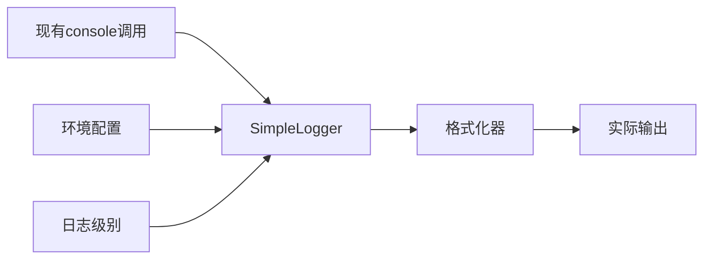

# 简化日志模块分析与设计

## 现有系统核心缺陷分析

### 1. 主要问题

通过分析42处console调用，发现以下核心缺陷：

| 缺陷 | 影响 | 优先级 |
|------|------|--------|
| **无日志级别控制** | 生产环境输出过多调试信息 | 高 |
| **无结构化格式** | 难以进行日志分析 | 高 |
| **无统一接口** | 各模块日志格式不一致 | 中 |
| **无上下文信息** | 缺乏请求追踪能力 | 中 |
| **无时间戳标准化** | 时间格式不统一 | 低 |

### 2. 必须解决的核心问题

1. **日志级别控制**: 根据环境控制日志输出
2. **统一格式**: 标准化日志输出格式
3. **简单替换**: 最小化代码修改工作量

## 简化设计方案

### 设计原则

1. **最小改动**: 保持现有console调用方式
2. **零依赖**: 不引入外部日志库
3. **配置驱动**: 通过环境变量控制行为
4. **向后兼容**: 现有代码无需大幅修改

### 核心架构



## 实现方案

### 1. 核心Logger类

```typescript
// src/utils/SimpleLogger.ts

export enum LogLevel {
  DEBUG = 0,
  INFO = 1,
  WARN = 2,
  ERROR = 3,
  FATAL = 4
}

export class SimpleLogger {
  private static instance: SimpleLogger;
  private currentLevel: LogLevel;
  private enableTimestamp: boolean;
  private enableModule: boolean;

  private constructor() {
    this.currentLevel = this.parseLogLevel(process.env.LOG_LEVEL || 'info');
    this.enableTimestamp = process.env.ENABLE_LOG_TIMESTAMP !== 'false';
    this.enableModule = process.env.ENABLE_LOG_MODULE !== 'false';
  }

  static getInstance(): SimpleLogger {
    if (!SimpleLogger.instance) {
      SimpleLogger.instance = new SimpleLogger();
    }
    return SimpleLogger.instance;
  }

  private parseLogLevel(level: string): LogLevel {
    switch (level.toLowerCase()) {
      case 'debug': return LogLevel.DEBUG;
      case 'info': return LogLevel.INFO;
      case 'warn': return LogLevel.WARN;
      case 'error': return LogLevel.ERROR;
      case 'fatal': return LogLevel.FATAL;
      default: return LogLevel.INFO;
    }
  }

  private shouldLog(level: LogLevel): boolean {
    return level >= this.currentLevel;
  }

  private formatMessage(level: string, module: string, message: string): string {
    const parts: string[] = [];
    
    if (this.enableTimestamp) {
      parts.push(`[${new Date().toISOString()}]`);
    }
    
    parts.push(`[${level}]`);
    
    if (this.enableModule && module) {
      parts.push(`[${module}]`);
    }
    
    parts.push(message);
    
    return parts.join(' ');
  }

  debug(module: string, message: string, ...args: any[]): void {
    if (this.shouldLog(LogLevel.DEBUG)) {
      console.debug(this.formatMessage('DEBUG', module, message), ...args);
    }
  }

  info(module: string, message: string, ...args: any[]): void {
    if (this.shouldLog(LogLevel.INFO)) {
      console.log(this.formatMessage('INFO', module, message), ...args);
    }
  }

  warn(module: string, message: string, ...args: any[]): void {
    if (this.shouldLog(LogLevel.WARN)) {
      console.warn(this.formatMessage('WARN', module, message), ...args);
    }
  }

  error(module: string, message: string, ...args: any[]): void {
    if (this.shouldLog(LogLevel.ERROR)) {
      console.error(this.formatMessage('ERROR', module, message), ...args);
    }
  }

  fatal(module: string, message: string, ...args: any[]): void {
    if (this.shouldLog(LogLevel.FATAL)) {
      console.error(this.formatMessage('FATAL', module, message), ...args);
    }
  }
}

// 便捷函数
export const logger = SimpleLogger.getInstance();

export const log = {
  debug: (module: string, message: string, ...args: any[]) => logger.debug(module, message, ...args),
  info: (module: string, message: string, ...args: any[]) => logger.info(module, message, ...args),
  warn: (module: string, message: string, ...args: any[]) => logger.warn(module, message, ...args),
  error: (module: string, message: string, ...args: any[]) => logger.error(module, message, ...args),
  fatal: (module: string, message: string, ...args: any[]) => logger.fatal(module, message, ...args)
};
```

### 2. 迁移策略

#### 阶段1: 创建SimpleLogger (1天)
1. 创建SimpleLogger类
2. 添加环境配置支持
3. 测试基本功能

#### 阶段2: 逐步替换 (2-3天)
1. 替换核心模块的console调用
2. 验证日志输出格式
3. 调整配置参数

#### 阶段3: 清理优化 (1天)
1. 移除未使用的配置
2. 更新文档
3. 性能验证

### 3. 替换示例

#### 替换前
```typescript
// src/errors/ErrorHandler.ts
console.error(`[CRITICAL]${contextStr}`, error);
console.warn(`[MEDIUM]${contextStr}`, error);

// src/middleware/globalErrorHandler.ts
console.log(`[${new Date().toISOString()}] ${req.method} ${req.path} - Request started`);
```

#### 替换后
```typescript
// src/errors/ErrorHandler.ts
import { log } from '@/utils/SimpleLogger';

log.error('ErrorHandler', `[CRITICAL]${contextStr}`, error);
log.warn('ErrorHandler', `[MEDIUM]${contextStr}`, error);

// src/middleware/globalErrorHandler.ts
import { log } from '@/utils/SimpleLogger';

log.info('GlobalErrorHandler', `${req.method} ${req.path} - Request started`);
```

### 4. 环境配置

#### .env.example
```bash
# 日志配置
LOG_LEVEL=info                    # debug, info, warn, error, fatal
ENABLE_LOG_TIMESTAMP=true        # 是否启用时间戳
ENABLE_LOG_MODULE=true           # 是否启用模块名
```

#### 不同环境的配置

##### 开发环境
```bash
LOG_LEVEL=debug
ENABLE_LOG_TIMESTAMP=true
ENABLE_LOG_MODULE=true
```

##### 生产环境
```bash
LOG_LEVEL=warn
ENABLE_LOG_TIMESTAMP=true
ENABLE_LOG_MODULE=false
```

##### 测试环境
```bash
LOG_LEVEL=error
ENABLE_LOG_TIMESTAMP=false
ENABLE_LOG_MODULE=false
```

### 5. 输出格式对比

#### 现有输出
```
TreeSitterService initialized
[CRITICAL][example-context] TreeSitterError: ...
[2023-11-18T05:10:00.000Z] GET /api/parse - Request started
```

#### 新的输出
```
[2023-11-18T05:10:00.000Z] [INFO] [TreeSitterService] TreeSitterService initialized
[2023-11-18T05:10:00.000Z] [ERROR] [ErrorHandler] [CRITICAL][example-context] TreeSitterError: ...
[2023-11-18T05:10:00.000Z] [INFO] [GlobalErrorHandler] GET /api/parse - Request started
```

## 实施计划

### 第1天: 基础实现
- [ ] 创建SimpleLogger类
- [ ] 实现基本的日志级别控制
- [ ] 添加格式化功能
- [ ] 编写单元测试

### 第2天: 核心模块迁移
- [ ] 替换ErrorHandler中的console调用
- [ ] 替换globalErrorHandler中的console调用
- [ ] 替换TreeSitterService中的console调用
- [ ] 验证输出格式

### 第3天: 全面迁移
- [ ] 替换其余模块的console调用
- [ ] 更新环境配置
- [ ] 验证不同环境的行为
- [ ] 性能测试

### 第4天: 优化和文档
- [ ] 性能优化
- [ ] 更新README文档
- [ ] 添加使用示例
- [ ] 最终测试

## 优势分析

### 1. 解决核心问题
- ✅ **日志级别控制**: 通过LOG_LEVEL环境变量控制
- ✅ **统一格式**: 标准化的时间戳和模块名格式
- ✅ **最小改动**: 保持现有调用方式，只需添加模块名参数

### 2. 保持简单
- ✅ **零外部依赖**: 仅使用Node.js原生console
- ✅ **单例模式**: 全局统一实例
- ✅ **配置驱动**: 通过环境变量控制所有行为

### 3. 易于维护
- ✅ **代码量少**: 核心代码不超过100行
- ✅ **逻辑简单**: 易于理解和修改
- ✅ **测试友好**: 容易进行单元测试

## 风险评估

### 低风险
- 代码改动量小，引入bug的概率低
- 保持向后兼容，不会破坏现有功能
- 可以逐步迁移，降低风险

### 缓解措施
- 分阶段实施，每个阶段都进行充分测试
- 保留原有console调用作为备份
- 通过环境变量控制新旧系统切换

## 总结

这个简化方案专注于解决现有系统的核心缺陷，避免了过度工程化：

1. **解决主要问题**: 日志级别控制、统一格式
2. **最小复杂度**: 核心代码简单易懂
3. **快速实施**: 3-4天即可完成
4. **易于维护**: 零依赖，配置驱动

相比之前的复杂方案，这个简化方案更适合当前项目的实际需求，能够在解决核心问题的同时保持系统的简洁性。