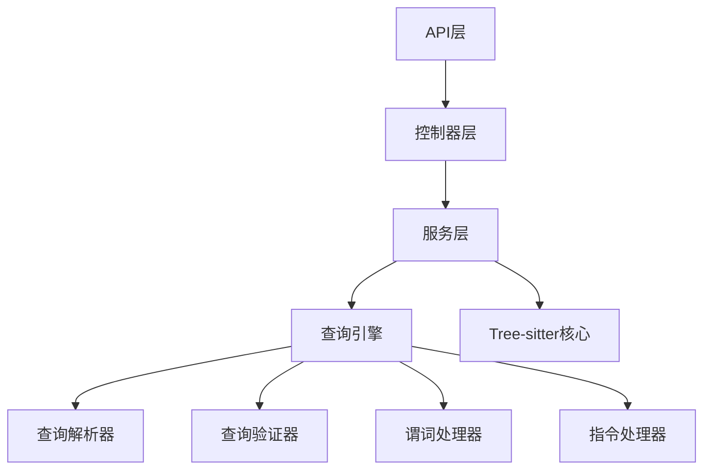

# Tree-sitter高级查询语法分析与增强方案

## 概述

本文档分析了tree-sitter支持的高级查询语法，评估了当前项目的tree-sitter解析服务对这些功能的支持程度，并提出了详细的修改方案以支持缺失的高级功能。

## Tree-sitter高级查询语法

### 1. 谓词（Predicates）

谓词用于对捕获的节点进行进一步的条件判断和过滤：

#### 基本谓词
- `#eq? capture "value"` - 检查捕获是否等于特定值
- `#match? capture "regex_pattern"` - 检查捕获是否匹配正则表达式
- `#any-of? capture ["value1", "value2"]` - 检查捕获是否匹配列表中的任何值
- `#is? capture "property_name"` - 检查捕获的特定属性

#### 否定谓词
- `not-#eq? capture "value"` - 检查捕获不等于特定值
- `not-#match? capture "regex_pattern"` - 检查捕获不匹配正则表达式
- `not-#is? capture "property_name"` - 检查捕获不具有特定属性

#### 量词谓词
- `any-#eq? capture "value"` - 量词捕获中任何一个满足条件
- `any-#match? capture "regex_pattern"` - 量词捕获中任何一个匹配模式

#### 示例
```tree-sitter
((identifier) @variable.builtin
  (#match? @variable.builtin "^(arguments|module|console|window|document)$")
  (#is-not? local))
```

### 2. 锚点（Anchors）

锚点用于约束模式匹配的位置关系：

- `.` - 确保子节点是第一个或最后一个命名节点，或兄弟节点是相邻的

#### 示例
```tree-sitter
(array . (identifier) @the-element)  // 匹配数组中的第一个元素
(block (_) @last-expression .)       // 匹配块中的最后一个表达式
```

### 3. 交替查询（Alternations）

使用方括号定义替代模式，类似于正则表达式中的字符类：

#### 示例
```tree-sitter
(call_expression
  function: [
    (identifier) @function
    (member_expression
      property: (property_identifier) @method)
  ])

[
  "break"
  "delete"
  "else"
  "for"
  "function"
  "if"
  "return"
  "try"
  "while"
] @keyword
```

### 4. 指令（Directives）

指令用于修改查询行为或处理捕获结果：

- `#set! key "value"` - 设置键值对
- `#strip! capture "regex_pattern"` - 根据正则表达式从捕获中移除文本
- `#select-adjacent! capture1 capture2` - 过滤捕获文本以保留仅与另一个指定捕获相邻的节点

#### 示例
```tree-sitter
((comment) @injection.content
  (#lua-match? @injection.content "/[*\/][!*\/]<?[^a-zA-Z]")
  (#set! injection.language "doxygen"))
```

### 5. 其他高级功能

#### 量词操作符
- `+` - 一个或多个
- `*` - 零个或多个
- `?` - 可选

#### 分组
使用括号分组兄弟节点序列：

```tree-sitter
(
  (comment)
  (function_declaration)
)
```

#### 通配符节点
- `(_)` - 匹配任何节点

## 当前实现分析

### 支持的功能

当前项目的tree-sitter解析服务（`src/core/TreeSitterService.ts`）支持以下功能：

1. **基本查询支持**：
   - 节点类型匹配
   - 捕获节点（使用@符号）
   - 基本的查询执行

2. **查询创建**：
   - 通过 `languageModule.query()` 创建查询
   - 通过 `new Query(languageModule, queryString)` 创建查询

3. **匹配执行**：
   - 使用 `query.matches(tree.rootNode)` 执行查询
   - 提取匹配结果和捕获信息

4. **结果处理**：
   - 提取节点类型、文本、位置信息
   - 基本的错误处理

### 不支持的功能

当前实现存在以下限制：

1. **谓词支持不完整**：
   - 没有专门的谓词验证和处理
   - 依赖底层tree-sitter库的自动处理
   - 缺少谓词相关的错误处理

2. **指令支持缺失**：
   - 完全不支持 `#set!`、`#strip!`、`#select-adjacent!` 等指令
   - 没有指令处理逻辑

3. **高级查询功能未暴露**：
   - 没有API层面的高级查询支持
   - 缺少查询语法验证
   - 没有查询特性分析

4. **查询验证有限**：
   - 当前验证只是尝试执行查询
   - 没有专门的语法验证
   - 缺少详细的错误信息

## 增强方案

### 1. 架构设计



### 2. 核心组件

#### 2.1 查询解析器（QueryParser）

```typescript
// src/core/QueryParser.ts
export class QueryParser {
  parseQuery(query: string): ParsedQuery;
  extractPredicates(query: string): QueryPredicate[];
  extractDirectives(query: string): QueryDirective[];
  validateQueryStructure(query: string): StructureValidationResult;
}

export interface ParsedQuery {
  patterns: QueryPattern[];
  predicates: QueryPredicate[];
  directives: QueryDirective[];
  features: QueryFeatures;
}

export interface QueryPredicate {
  type: 'eq' | 'match' | 'any-of' | 'is' | 'not-eq' | 'not-match' | 'any-eq' | 'any-match';
  capture: string;
  value: string | string[];
  negate?: boolean;
  quantifier?: 'any' | 'all';
  position?: Position;
}

export interface QueryDirective {
  type: 'set' | 'strip' | 'select-adjacent';
  capture: string;
  parameters: any[];
  position?: Position;
}
```

#### 2.2 查询验证器（QueryValidator）

```typescript
// src/core/QueryValidator.ts
export class QueryValidator {
  validateQuerySyntax(query: string): ValidationResult;
  validatePredicates(query: string): PredicateValidationResult;
  validateDirectives(query: string): DirectiveValidationResult;
  extractQueryFeatures(query: string): QueryFeatures;
}

export interface ValidationResult {
  isValid: boolean;
  errors: ValidationError[];
  warnings: ValidationWarning[];
  features: QueryFeatures;
}

export interface QueryFeatures {
  hasPredicates: boolean;
  hasDirectives: boolean;
  hasAnchors: boolean;
  hasAlternations: boolean;
  hasQuantifiers: boolean;
  predicateCount: number;
  directiveCount: number;
}
```

#### 2.3 增强的查询执行器（QueryExecutor）

```typescript
// src/core/QueryExecutor.ts
export class QueryExecutor {
  executeQueryWithPredicates(query: string, tree: TreeSitterTree): EnhancedMatchResult[];
  processDirectives(matches: QueryMatch[], directives: QueryDirective[]): ProcessedMatchResult[];
  applyPredicates(matches: QueryMatch[], predicates: QueryPredicate[]): FilteredMatchResult[];
}

export interface EnhancedMatchResult extends MatchResult {
  metadata?: Record<string, any>;
  processedText?: string;
  adjacentNodes?: MatchResult[];
  predicateResults?: PredicateResult[];
}
```

#### 2.4 指令处理器（DirectiveProcessor）

```typescript
// src/core/DirectiveProcessor.ts
export class DirectiveProcessor {
  processSetDirective(capture: string, key: string, value: string): void;
  processStripDirective(capture: string, pattern: string): string;
  processSelectAdjacentDirective(capture1: string, capture2: string): MatchResult[];
  processDirectives(matches: MatchResult[], directives: QueryDirective[]): ProcessedMatchResult[];
}
```

#### 2.5 谓词处理器（PredicateProcessor）

```typescript
// src/core/PredicateProcessor.ts
export class PredicateProcessor {
  processEqualityPredicate(capture: string, value: string, negate?: boolean): boolean;
  processMatchPredicate(capture: string, pattern: string, negate?: boolean): boolean;
  processAnyOfPredicate(capture: string, values: string[]): boolean;
  processIsPredicate(capture: string, property: string, negate?: boolean): boolean;
  applyPredicates(matches: QueryMatch[], predicates: QueryPredicate[]): FilteredMatchResult[];
}
```

### 3. 类型定义扩展

```typescript
// src/types/advancedQuery.ts
export interface AdvancedParseRequest extends ParseRequest {
  enableAdvancedFeatures?: boolean;
  processDirectives?: boolean;
  includeMetadata?: boolean;
  validatePredicates?: boolean;
}

export interface AdvancedParseResult extends ParseResult {
  queryFeatures?: QueryFeatures;
  processedMatches?: EnhancedMatchResult[];
  directives?: QueryDirective[];
  predicates?: QueryPredicate[];
  validationResults?: ValidationResult;
}

export interface QueryAnalysis {
  query: string;
  features: QueryFeatures;
  predicates: QueryPredicate[];
  directives: QueryDirective[];
  validation: ValidationResult;
}
```

### 4. API接口扩展

#### 4.1 新增路由端点

```typescript
// src/routes/advancedQuery.ts
router.post('/advanced', validateAdvancedParseRequest, async (req, res) => {
  // 处理高级查询请求
});

router.post('/analyze-query', async (req, res) => {
  // 分析查询语法，返回谓词和指令信息
});

router.post('/validate-query', async (req, res) => {
  // 验证查询语法，返回详细的验证结果
});
```

#### 4.2 控制器扩展

```typescript
// src/controllers/advancedQueryController.ts
export const createAdvancedQueryController = (service: TreeSitterService) => {
  const parseWithAdvancedFeatures = async (req: Request, res: Response): Promise<void> => {
    // 使用增强的查询执行引擎
  };

  const analyzeQuery = async (req: Request, res: Response): Promise<void> => {
    // 分析查询语法，返回谓词和指令信息
  };

  const validateAdvancedQuery = async (req: Request, res: Response): Promise<void> => {
    // 验证高级查询语法
  };

  return {
    parseWithAdvancedFeatures,
    analyzeQuery,
    validateAdvancedQuery,
  };
};
```

### 5. 配置扩展

```typescript
// src/config/query.ts
export interface QueryConfig {
  enablePredicates: boolean;
  enableDirectives: boolean;
  enableAdvancedValidation: boolean;
  maxPredicatesPerQuery: number;
  maxDirectivesPerQuery: number;
  allowedDirectives: string[];
  allowedPredicates: string[];
}

export const DefaultQueryConfig: QueryConfig = {
  enablePredicates: true,
  enableDirectives: true,
  enableAdvancedValidation: true,
  maxPredicatesPerQuery: 50,
  maxDirectivesPerQuery: 20,
  allowedDirectives: ['set', 'strip', 'select-adjacent'],
  allowedPredicates: ['eq', 'match', 'any-of', 'is', 'not-eq', 'not-match', 'any-eq', 'any-match'],
};
```

### 6. 错误处理扩展

```typescript
// src/types/errors.ts
export class QuerySyntaxError extends TreeSitterError {
  constructor(message: string, public position?: Position) {
    super(ErrorType.QUERY_SYNTAX_ERROR, ErrorSeverity.MEDIUM, message);
  }
}

export class PredicateError extends TreeSitterError {
  constructor(predicate: string, message: string) {
    super(ErrorType.PREDICATE_ERROR, ErrorSeverity.MEDIUM, `Predicate ${predicate}: ${message}`);
  }
}

export class DirectiveError extends TreeSitterError {
  constructor(directive: string, message: string) {
    super(ErrorType.DIRECTIVE_ERROR, ErrorSeverity.MEDIUM, `Directive ${directive}: ${message}`);
  }
}
```

## 实施计划

### 第一阶段：基础架构（1-2周）
1. 创建查询解析器（QueryParser）
2. 创建查询验证器（QueryValidator）
3. 扩展类型定义
4. 基础的查询语法分析

### 第二阶段：谓词支持（2-3周）
1. 实现谓词处理器（PredicateProcessor）
2. 增强查询执行器以支持谓词
3. 添加谓词相关的错误处理
4. 单元测试

### 第三阶段：指令支持（2-3周）
1. 实现指令处理器（DirectiveProcessor）
2. 支持基本的指令（set, strip, select-adjacent）
3. 集成指令处理到查询执行流程
4. 集成测试

### 第四阶段：API扩展（1-2周）
1. 扩展控制器和服务
2. 添加新的路由端点
3. 实现高级查询API
4. API文档更新

### 第五阶段：测试和优化（1-2周）
1. 完善单元测试和集成测试
2. 性能优化
3. 文档完善
4. 代码审查

## 预期效果

实施此方案后，项目将具备以下能力：

1. **完整的谓词支持**：支持所有tree-sitter谓词，包括基本谓词、否定谓词和量词谓词
2. **指令处理能力**：支持set、strip、select-adjacent等指令
3. **高级查询验证**：提供详细的查询语法验证和错误信息
4. **查询分析功能**：能够分析查询特性和复杂度
5. **增强的API**：提供专门的API端点处理高级查询
6. **更好的错误处理**：针对高级查询功能的专门错误处理

## 风险评估

1. **复杂性增加**：高级查询功能会增加系统复杂性
2. **性能影响**：谓词和指令处理可能影响查询性能
3. **兼容性**：需要确保向后兼容性
4. **测试覆盖**：需要全面的测试覆盖各种查询场景

## 结论

通过实施此增强方案，项目的tree-sitter解析服务将能够充分利用tree-sitter的高级查询语法，显著提升代码分析和查询能力。这将使项目在代码解析、语法分析、代码导航等方面具备更强大的功能，为用户提供更丰富的代码分析体验。